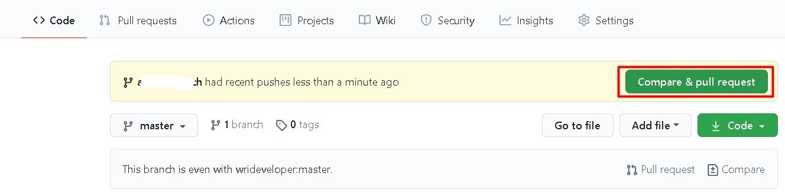
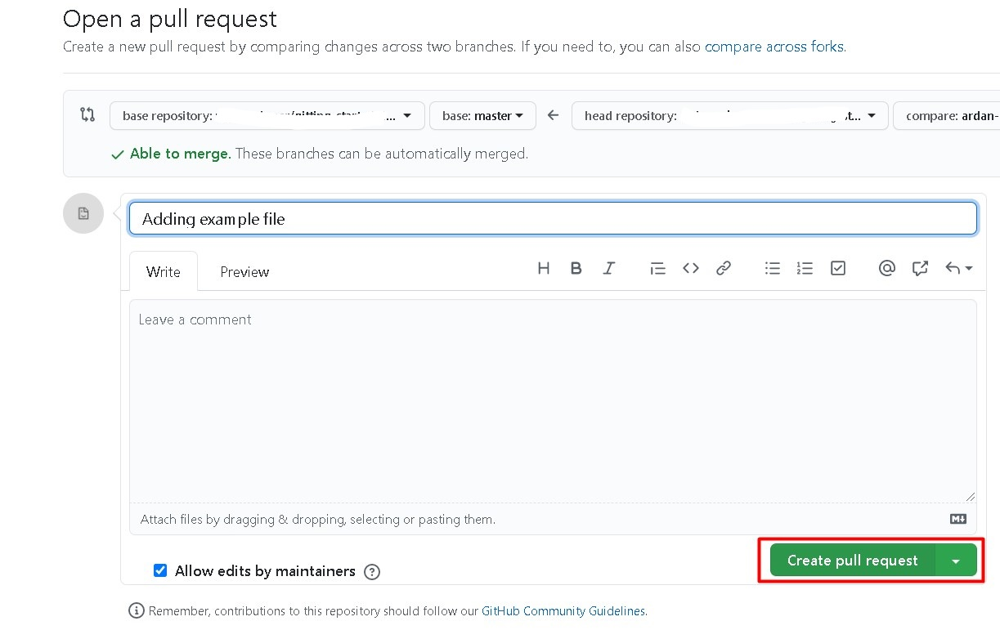
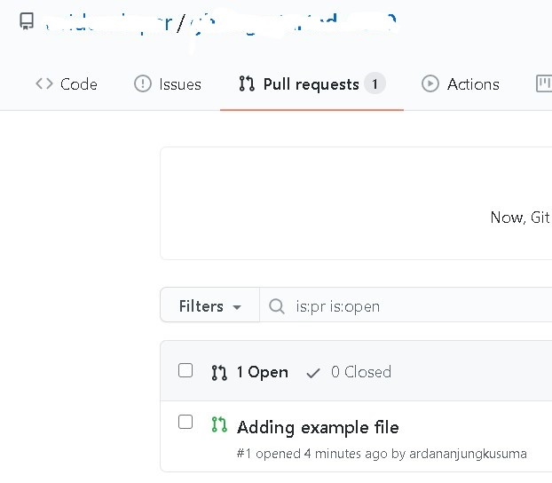

# Website Laporan Kemajuan LA

Dharma

## Cara Kontribusi :inbox_tray:

### 1. Fork Repository

Pada pojok kanan atas terdapat sebuah button untuk fork, silahkan fork repository ini

### 2. Clone Repository di Akunmu

Pergilah ke halaman akun github anda, pilih bagian menu repository lalu pilih repository web-kemajuan-la

`git clone https://github.com/usernamekamu/web-kemajuan-la.git`

### 3. Buat Branch Baru

Masuk ke folder yang telah anda clone tadi, lalu ketikkan perintah berikut pada git bash

`git checkout -b usernamekamu-branch`

### 4. Coding :smirk_cat:

Silahkan lakukan coding, sesuai tugas masing - masing

Jangan sembarangan dalam membuat struktur folder dan file ya, nanti pullreqnya akan anggap tidak valid :stuck_out_tongue:

### 5. Push Project Anda

Kembalilah ke root folder. Lalu tambahkan folder yang telah anda buat tadi, jika anda sudah membuat folder maka tambahkan file yang anda buat tadi.

`git add .`

Tambahkan pesan commit

`git commit -m "menyelesaikan fitur login"`

Push project yang telah anda buat dengan perintah

`git push -u origin usernamekamu-branch`

### 6. Buat Pull Request

Buka kembali browsermu dan pergi ke repository web-kemajuan-la milikmu. Jika berhasil melakukan perubahan atau penambahan suatu file maka akan muncul tombol berikut untuk membandingkan dan membuat pull request. Klik tombol berikut.

Setelah itu scroll agak kebawah dan klik tombol create pull request

Dan anda telah berhasil membuat pull request.

